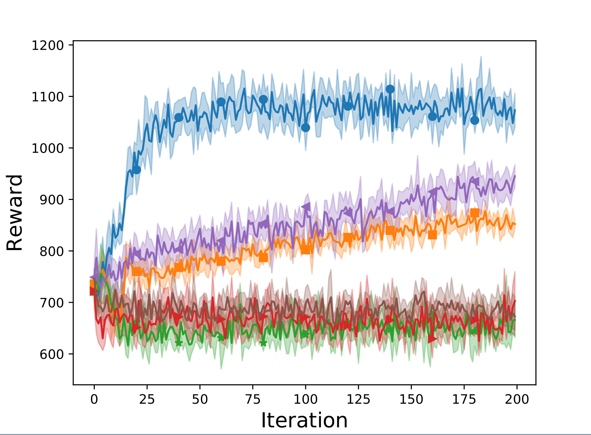
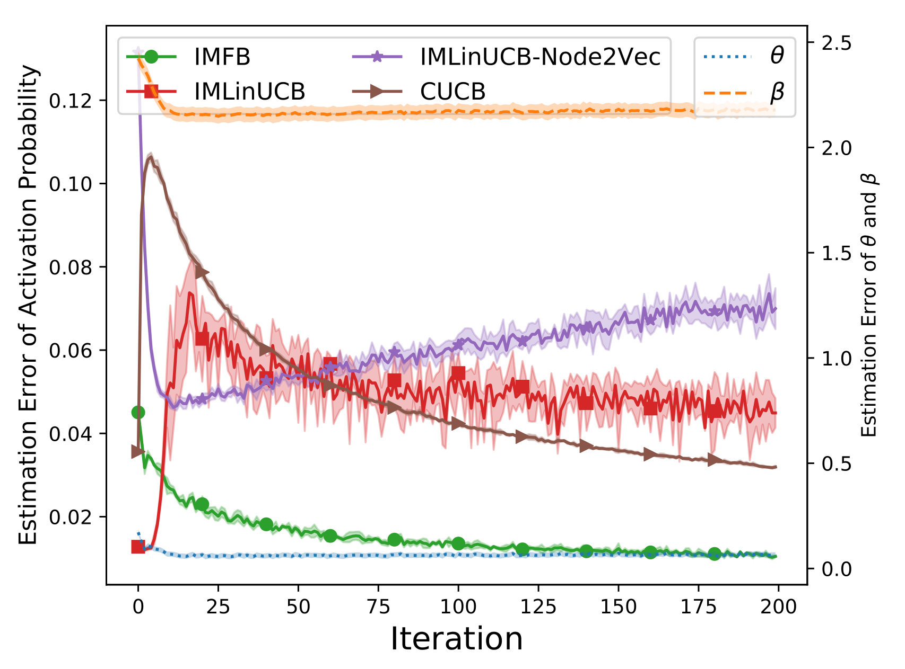
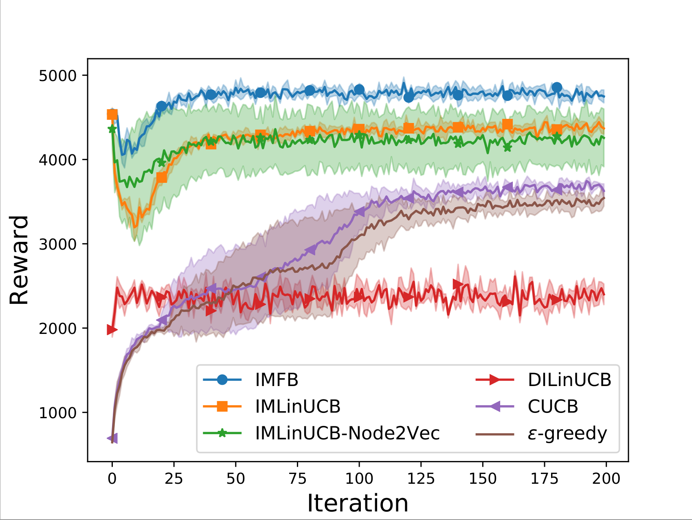
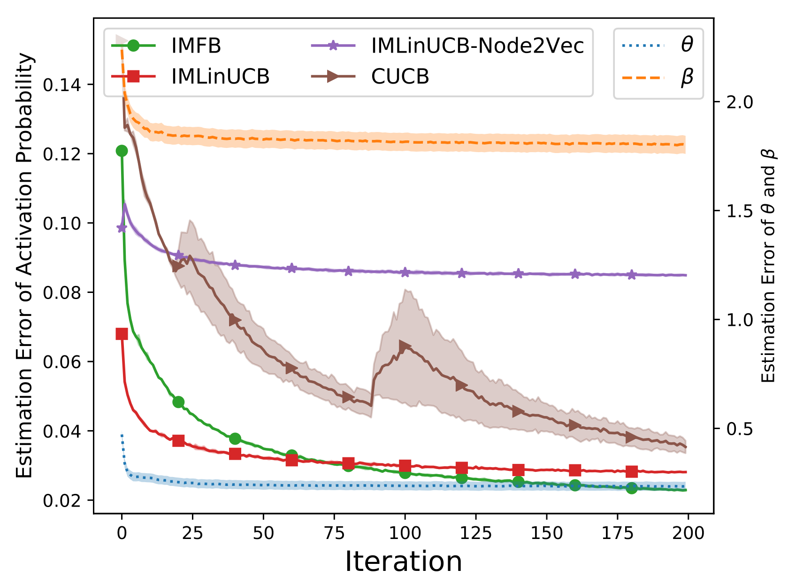

# Online Influence Maximization with Bandits

This repo contains the implementation of the online influence maximization algorithm IMFB, which is published in SIGKDD 2019 [1], together with several baselines.


## An overview of the files in this folder
IMBandit.py -- Simulator. Can run the experiments with command ```python IMBandit.py``` 

BanditAlg -- Baselines for running influence maximization problems.

Oracle/degreeDiscount.py, generalGreedy.py -- Two different oracles (IM algorithm).

IC/IC.py -- Independent cascade model, runIC() returns influence result given seed nodes.

SampleFeature -- This folder include scripts for dataset pre-processing.

conf.py -- The relative parameters used for the experiments. 

SimulationResults -- The folder saved for the results. 

## Experiment detail

### 1. Data pre-processing

- Get the original Flickr and NetHEPT datasets via [Stanford Large Network Dataset Collection](https://snap.stanford.edu/data/)

- Run `python ./SampleFeature/SampleSubgraph.py` to get the sub-sampled graph which will be saved into a file named `Small_Final_SubG.G`.

- Run `python ./SampleFeature/GenerateNodeFeature.py` to get the node features, which will be saved into a file named `Small_nodeFeatures.dic`, and edge activation probability, which will be saved into a file named `Probability.dic` in the corresponding dataset folder.

- Run  `python ./SampleFeature/GenerateEdgeFeature.py` to get the edge features, which will be saved into a file named `Small_edgeFeatures.dic`.


### 2. Experiment hyperparameters

```python
graph_address = './datasets/Flickr/Small_Final_SubG.G'
prob_address = './datasets/Flickr/Probability.dic'
param_address = './datasets/Flickr/Small_nodeFeatures.dic'
edge_feature_address = './datasets/Flickr/Small_edgeFeatures.dic'
dataset = 'Flickr-Random' #Choose from 'default', 'NetHEPT', 'Flickr'

dataset = 'Flickr' #Choose from 'default', 'NetHEPT', 'Flickr'
alpha_1 = 0.1
alpha_2 = 0.1
lambda_ = 0.4
gamma = 0.1
dimension = 4
seed_size = 300
iterations = 200

oracle = degreeDiscountIAC3
```
Run `python IMBandit.py` to reproduce our experiments (the hyperparameters listed above are already included in the `IMBandit.py` file).

#### 3. Experiment Results
- Result on Flickr dataset: 12812 nodes, 137986 edges

<p float="left">


</p>


- Result on NetHEPT dataset: 27770 nodes, 352807 edges

<p float="left">


</p>


## References
[1]: Wu, Qingyun, Zhige Li, Huazheng Wang, Wei Chen, and Hongning Wang. "Factorization bandits for online influence maximization." In Proceedings of the 25th ACM SIGKDD International Conference on Knowledge Discovery & Data Mining, pp. 636-646. 2019.
